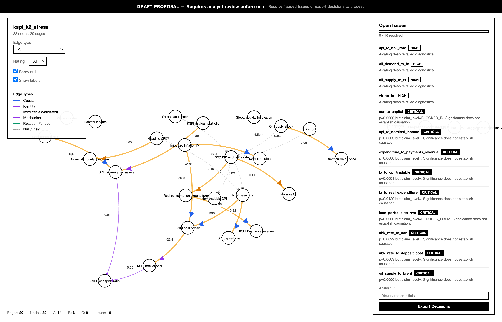
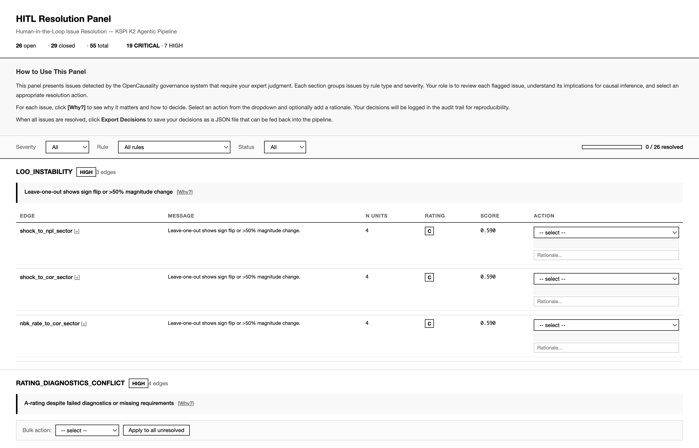
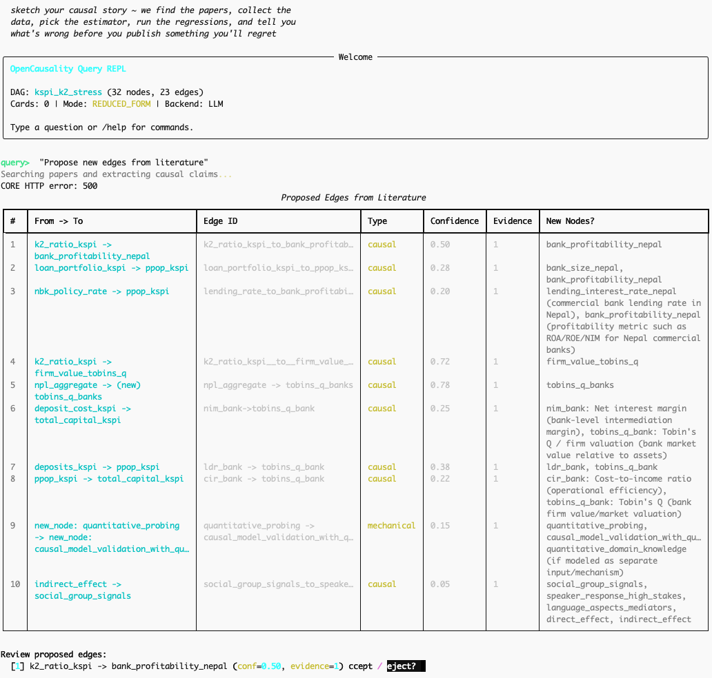

```
    ___                    ____                        _ _ _
   / _ \ _ __   ___ _ __  / ___|__ _ _   _ ___  __ _ | (_) |_ _   _
  | | | | '_ \ / _ \ '_ \| |   / _` | | | / __|/ _` || | | __| | | |
  | |_| | |_) |  __/ | | | |__| (_| | |_| \__ \ (_| || | | |_| |_| |
   \___/| .__/ \___|_| |_|\____\__,_|\__,_|___/\__,_||_|_|\__|\__, |
        |_|                                                    |___/

  ~  sketch your causal story  ~  we find the papers, collect the
  data, pick the estimator, run the regressions, and tell you
  what's wrong before you publish something you'll regret  ~

       dag.yaml                         edge cards
     .----------.    +-----------+    .-----------.
    / A -------> B   | estimate  |   | point: 0.3 |
   |   \       / |   | diagnose  |   | se:  0.08  |
   |    v     v  |-->| flag      |-->| rating: B+ |
   |     C---/   |   | literature|   | issues: 2  |
    \   dag    ./    +-----------+    '-----------'
     '--------'     agentic engine     your results
```

# OpenCausality

Open-source platform for transparent, auditable causal inference. Combines DAG-based causal reasoning with agentic estimation, human-in-the-loop governance, LLM-assisted literature extraction, and an always-on sentinel loop that continuously validates, heals, and surfaces results.

> **Paper:** [OpenCausality: Auditable Agentic Causal Inference with DAG-Based Reasoning and LLM-Assisted Discovery](paper/main.pdf) (Li, 2026)

Causal inference across the sciences — economics, epidemiology, public policy, social
science, marketing, and beyond — is fragile. Automated pipelines scale but hide
methodological choices; manual analysis is transparent but slow. OpenCausality resolves
this by treating every estimation decision as an auditable event. You specify a causal
DAG in YAML, the system dispatches to the appropriate estimation engine (from local
projections to double ML to synthetic control), and a 30-rule issue detection engine
flags problems — overclaiming, control shopping, null dropping, specification drift,
timing failures — before results reach your paper, report, or dashboard. A
human-in-the-loop panel ensures no statistical claim passes without explicit analyst
approval. A **sentinel loop** runs continuously in the background, re-validating the
DAG after every change, auto-fixing schema issues (missing unit specs, malformed edge
IDs), and popping up interactive panels — the DAG visualization and HITL review board
— so analysts never have to hunt for results. The platform also ships with an
NL-to-DAG pipeline that extracts causal structures from academic papers via LLM,
letting you bootstrap DAGs from existing literature and compare them against
expert-built specifications.

## Why OpenCausality

The past decade of data science was shaped by a single economic force: the plummeting
cost of storage and compute made it cheaper to collect everything and predict than to
think carefully and explain. Predictive ML flourished not because prediction is what
organizations need most, but because big data made it the path of least resistance.
Correctness — understanding *why* something happens — was never the optimization target.

This matters because prediction, causal interpretation, and causal inference are
fundamentally different things. A predictive model can exploit any statistical
regularity — including spurious correlations and confounded associations — and still
forecast well, without representing the actual data generating process at all. Causal
interpretation goes a step further: it takes an observed correlation and attaches a
story about cause and effect. But a plausible story about *why* two variables move
together is not evidence that intervening on one will change the other. Correlations
can arise from confounding, reverse causality, or selection — none of which a
predictive model or a post-hoc narrative is designed to detect. Causal inference, by
contrast, is the discipline of recovering the data generating process itself:
specifying which variables cause which, under what assumptions identification holds,
and what would happen under intervention. That is a qualitatively harder problem than
prediction, and it is the problem that matters when decisions have consequences.

Yet causal reasoning is not a niche academic skill. It is among the most fundamental
forms of intelligence: pre-linguistic, rooted in physical interaction with the world,
present in infants long before they can speak. Every time a child pushes a block off a
table, they are running a causal experiment. This is the reasoning mode that AI systems
need to create real-world value — not just correlation-surfing, but genuine
understanding of mechanism and intervention.

The bottleneck is not insight. Researchers across economics, epidemiology, and the
social sciences already carry rich causal intuitions about their domains. The bottleneck
is tooling: the mechanical overhead of translating a causal story into a formal DAG,
selecting an appropriate estimator, diagnosing identification failures, and documenting
every decision for reproducibility. Researchers spend their time fighting software
instead of forming and testing hypotheses.

OpenCausality removes that bottleneck. You describe your causal story — in YAML or
plain English — and the framework handles the rest: DAG construction, estimator
dispatch, diagnostic checking, issue detection, and audit-trail generation. The human
stays where humans are irreplaceable — judging whether the causal narrative makes
sense — while the machine handles what machines do well: mechanical, repeatable,
auditable computation.

**Who is this for?** Researchers, data scientists, and analysts who need to make causal
claims from observational data — and need those claims to be auditable, reproducible,
and defensible. Whether you are running a randomized experiment in a tech company,
estimating treatment effects in a clinical trial, evaluating a policy intervention, or
building a macroeconomic transmission model, OpenCausality provides the governance
layer that turns ad-hoc analysis into a structured, reviewable process.

---

## Quick Start

```bash
# Install
pip install -e .

# Setup (creates .env with API keys)
opencausality init

# Drop data into data/raw/ and ingest
opencausality data ingest

# List available DAGs
opencausality dag list

# Run estimation
opencausality dag run config/agentic/dags/kspi_k2_full.yaml --verbose

# Interactive causal query
opencausality query --dag config/agentic/dags/kspi_k2_full.yaml

# Monitor for HITL notifications
opencausality monitor
```

### Prerequisites

- Python 3.10+
- One of: Anthropic API key, OpenAI API key (via LiteLLM), or `codex`/`claude` CLI installed (no key needed)
- Panel data in CSV or Parquet format

Running `opencausality init` generates a `.env` file. LLM provider options:
- `LLM_PROVIDER=anthropic` with `ANTHROPIC_API_KEY=sk-ant-...`
- `LLM_PROVIDER=litellm` with `OPENAI_API_KEY=sk-...` (routes through LiteLLM)
- `LLM_PROVIDER=codex` (default) -- shells out to `codex exec`, no API key needed
- `LLM_PROVIDER=claude_cli` -- shells out to `claude -p`, no API key needed

If `LLM_PROVIDER=anthropic` but no API key is set, the system auto-falls back to
the codex CLI provider with a warning.

---

## How It Works

OpenCausality operates on a simple premise: every causal claim should be backed by a
DAG, estimated with appropriate methods, and subjected to automated checks before human
review. The framework is domain-agnostic — it works with any observational or
experimental dataset where causal relationships can be represented as a directed graph.

The starting point is a YAML DAG specification. Each node represents an observable
variable and each directed edge represents a hypothesized causal relationship, carrying
metadata — expected sign, lag structure, identification strategy, unit specs — that
constrain the estimation engine. The causal model is an explicit, version-controlled
artifact, not something implicit in the code.

The estimation engine processes each edge independently through a unified adapter
registry. 19 adapters span classical econometrics, machine-learning-based causal
inference, and quasi-experimental designs: Local Projections (HAC SE), Panel LP, Panel
FE Backdoor (`linearmodels.PanelOLS`), IV 2SLS, Difference-in-Differences, RDD,
Regression Kink, Synthetic Control, DoWhy (Backdoor/IV/Frontdoor with automated
refutation), DoubleML (PLR/IRM/PLIV), EconML (CATE via LinearDML and CausalForest),
CausalML (S/T/X-learner uplift), plus Immutable Evidence, Accounting Bridge, and
Identity adapters. Each implements a common `EstimationRequest -> estimate() ->
EstimationResult` interface, so new methods plug in without touching dispatch code.
Data assembly, control set construction from DAG conditional independence structure,
and impulse response functions at multiple horizons are handled upstream; every
estimation call is logged with its full specification so that no result is an orphan.

After estimation, 30 issue detection rules scan for common methodological failures:
significant results without valid identification, p-hacking through control selection,
silent dropping of null results, and temporal ordering violations. Issues requiring
human judgment are routed to the HITL panel rather than silently resolved.

The final output: EdgeCards (YAML, one per edge), an HTML HITL panel, a markdown system
report with credibility ratings, and a hash-chained JSONL audit log.

### The Pipeline

1. **Sentinel Auto-Start** -- The estimation pipeline auto-starts the sentinel loop
   in the background on first run. The loop validates, monitors, and heals
   continuously while estimation proceeds.
2. **DAG Specification** -- Define nodes and edges in YAML with expected signs,
   identification strategies, lag structures, and unit specs.
3. **Auto-Ingest** -- Any files dropped in `data/raw/` are automatically profiled,
   standardized to Parquet, and registered as node loaders before estimation begins.
4. **Data Scout** -- Catalog datasets, match variables to DAG nodes, assemble
   estimation-ready panels (CSV/Parquet, automatic frequency detection). When
   auto-download fails, actionable guidance is logged telling users which files to
   drop and in what format.
5. **Paper Scout** -- Search Semantic Scholar, OpenAlex, CORE, and arXiv for
   literature supporting or challenging each edge. When a local PDF is available,
   full-text extraction via pymupdf/pypdf feeds richer causal claims to the LLM.
   Citations attached to EdgeCards with relevance scores.
6. **Design Selection** -- Check back-door/front-door criteria for each edge; flag
   edges where identification is absent.
7. **Estimation** -- Adapter registry dispatches to one of 19 adapters:
   econometric (LP, Panel LP, Panel FE Backdoor, IV 2SLS, DID, RDD, Regression
   Kink, Synthetic Control), ML-based (DoWhy Backdoor/IV/Frontdoor, DoubleML
   PLR/IRM/PLIV, EconML CATE, CausalML Uplift), and deterministic (Immutable,
   Accounting Bridge, Identity).
   Controls derived from DAG structure. HAC standard errors at multiple horizons.
8. **DAG Auto-Repair** -- LLM-assisted validation loop that detects and fixes DAG
   errors (invalid edge IDs, missing dependencies) up to 3 attempts before
   falling back to human review. Governed by PatchPolicy.
9. **Issue Detection** -- 30 rules flag overclaiming, control shopping, null dropping,
   specification drift, timing failures. Each produces a typed issue with severity.
10. **PatchBot Auto-Fix** -- Auto-fixable issues (e.g., missing edge units) are
    repaired by PatchBot within policy constraints. Fixes are logged in the audit trail.
11. **HITL Review** -- Flagged issues surfaced in an interactive HTML panel. Analyst
    selects action (accept, reject, revise, escalate) with justification.
12. **System Report** -- Aggregated results with per-edge credibility ratings, DAG
    assessment, and literature links. Output as markdown.
13. **Panel Auto-Open** -- On completion, the DAG visualization and HITL panel are
    rebuilt and automatically opened in the browser.

---

## Case Study: Kazakhstan Bank Stress Testing

This end-to-end example demonstrates OpenCausality on a macroeconomic transmission
problem. The same workflow applies to clinical trials, A/B test analysis, policy
evaluation, or any domain where causal structure can be expressed as a DAG.

### The Research Question

Kazakhstan's banking sector experienced significant stress during the 2015-2016
commodity price collapse. The tenge lost roughly half its value against the dollar in
a managed float adjustment, and inflation surged past 17 percent. The central question
is whether -- and through which channels -- this exchange rate shock propagated to bank
capital adequacy ratios, and whether the transmission mechanism operated through credit
risk (loan defaults), market risk (FX-denominated liabilities), or the real economy
channel (GDP contraction reducing borrower repayment capacity).

This is not a simple bivariate question. The causal chain from FX shock to bank capital
runs through at least four intermediate variables: inflation, interest rates, GDP
growth, and non-performing loan ratios. Each link in the chain requires separate
identification, and the timing matters -- if inflation leads the exchange rate rather
than lagging it, the proposed mechanism is invalidated. OpenCausality handles this by
estimating each edge independently while enforcing consistency across the full DAG.

### Approach 1: Manual DAG Construction

The expert-built DAG contains 32 nodes and 23 directed edges spanning macroeconomic
variables (exchange rate, CPI, GDP, policy rate), banking variables (capital adequacy,
NPLs, loan growth, deposit dollarization), and external variables (oil price, global
risk appetite). Building it required ~40 hours of literature review and consultation
with Kazakhstan banking specialists. The specification is stored in
`config/agentic/dags/kspi_k2_full.yaml`.

### Approach 2: Natural Language to DAG

Given a plain-text narrative describing causal mechanisms, the pipeline extracts a
structured DAG automatically. Here is the input narrative
([`examples/kaspi_narrative.txt`](examples/kaspi_narrative.txt)):

<details>
<summary><b>Example narrative input (click to expand)</b></summary>

> When the tenge depreciates, it doesn't raise all prices equally -- it shows up first
> and most clearly in import-heavy parts of the CPI (like clothing, furnishings, and
> some food), while regulated categories (utilities, education, communications) mostly
> don't react, which is exactly the pattern you'd expect if the exchange rate is causally
> feeding "imported inflation." That imported inflation then squeezes households'
> purchasing power because incomes -- especially wages -- don't instantly adjust, so real
> disposable income and real spending tend to soften even if headline nominal income looks
> steadier on paper (often because transfers and regulated prices buffer the shock). For
> Kaspi, the key point is that this household squeeze can translate into balance-sheet
> pressure through two main routes: repayment stress (higher delinquencies/provisions)
> and profitability pressure from tighter financial conditions (higher funding costs and
> lower margins), and there's also a direct macro channel where an increase in "macro
> provisioning" even before realized defaults rise. All of this ultimately matters because
> Kaspi's capital headroom is driven by what happens to profits and provisions (capital
> numerator) and by loan/risk-weight dynamics (RWA denominator), while the holding
> company's ability to support the bank depends on whether consumer spending holds up
> enough to sustain non-bank revenues and dividends during stress.

</details>

```bash
python scripts/generate_narrative_dag.py \
    --narrative examples/kaspi_narrative.txt \
    --base-dag config/agentic/dags/kspi_k2_full.yaml \
    --out config/agentic/dags/kspi_k2_narrative.yaml
```

The NL-to-DAG pipeline uses PaperDAGExtractor to process academic papers and research
narratives. The LLM reads text describing causal relationships, extracts variable names
and directed edges, maps them to standardized node identifiers, and produces a YAML DAG.
Structured prompts require the LLM to distinguish between claimed causal relationships
and mere correlational statements.

The pipeline operates in two stages: raw extraction produces candidate nodes and edges
with confidence scores, then a matching step aligns extracted variables against a base
DAG or variable catalog. This means the system can both extend an existing DAG and
build one from scratch.

### Comparison

| Metric                         | Expert DAG | NL-Extracted DAG |
|--------------------------------|------------|------------------|
| Nodes                          | 32         | 18               |
| Edges                          | 23         | 12               |
| Structural matches             | --         | 3 / 23 (13%)     |
| Novel edges (not in expert)    | --         | 9                |
| Missing edges (expert only)    | --         | 20               |
| Estimate match (common edges)  | --         | 3/3 (100%)       |

The NL pipeline extracts causal claims from a single paragraph; recall improves
with longer or multi-document input. All 3 overlapping edges produce identical
estimates to the expert manual pipeline.

### What NL Found That Experts Missed

The NL extraction pipeline identified nine edges absent from the expert-built DAG.
Three are particularly notable: a link from global risk appetite (VIX) to bank
funding costs (consistent with the risk-taking channel literature), a household
income squeeze channel from real income to cost of risk (the bank lending channel),
and a direct link from pre-provision operating profit to total capital (a fundamental
banking relationship). These edges represent the kind of cross-domain connections
that domain specialists may overlook when focused on a specific transmission channel.

### What Experts Built That NL Missed

Twenty edges in the expert DAG were absent from NL extraction. These span upstream
shock transmission (oil supply/demand shocks to exchange rate, VIX to exchange rate),
monetary policy mechanics (CPI and FX to policy rate), banking balance sheet mechanics
(loan portfolio and portfolio mix to RWA, total capital to K2 ratio), and
country-specific institutional details (the IV instrument construction, nominal-to-real
deflation identities). Literature-based extraction from a single paragraph cannot
capture the full chain from global shocks to bank capital.

### Generated Panels

After estimation completes, the sentinel auto-builds and opens two interactive HTML
panels. Both are self-contained single-file HTML documents with no external dependencies
(except D3.js CDN for the visualization).

#### DAG Visualization ([`outputs/agentic/dag_visualization.html`](outputs/agentic/dag_visualization.html))



Interactive force-directed graph of the full causal DAG, built with D3.js v7.
Serves as the **primary entry point for proposal review**: the output is framed as
a draft requiring analyst sign-off, with inline decision capabilities so reviewers
can resolve issues without switching to a separate panel.

<details>
<summary><b>Panel features</b></summary>

- **"DRAFT PROPOSAL" banner** at top, framing the output as requiring analyst review
- **Nodes** as draggable circles with labels; dashed borders for latent variables,
  red rings for identification risks
- **Edges** color-coded by type (back-door, front-door, IV, etc.) with coefficient
  labels; dashed lines for null results; orange stroke for edges with CRITICAL issues;
  dimmed dashed stroke for fully resolved edges
- **Hover tooltips** showing edge estimates, p-values, identification status, controls,
  and any open issues with severity
- **Controls panel** (top-left): filter by edge type, toggle labels, zoom reset
- **Click-to-highlight**: clicking a sidebar issue highlights the corresponding edge
  with a pulse animation and pans the viewport to center it
- **Inline decision panels**: each issue expands to show registry-powered explanation
  ("Why it matters") and guidance ("Decision guidance"), rule-specific action dropdown
  with tooltips, justification field, and confirm/defer buttons
- **Progress tracking**: progress bar shows resolution count; confirmed issues are
  visually marked as resolved (dimmed, strikethrough)
- **JSON export**: download all decisions matching the HITL panel format, tagged with
  `source: "dag_visualization"` for audit trail distinction

</details>

#### HITL Resolution Panel ([`outputs/agentic/hitl_panel.html`](outputs/agentic/hitl_panel.html))



Interactive review board for human-in-the-loop issue resolution.

<details>
<summary><b>Panel features</b></summary>

- **Stats bar** at top: total issues, critical/high/medium counts, resolution progress
- **Filter controls**: filter by severity, edge, issue type; full-text search
- **Issue cards** with severity-coded headers (red = critical, amber = high),
  edge context with estimates, rule description, and methodological references
- **Action dropdowns**: accept / reject / revise / escalate, with justification
  text fields for audit trail
- **Bulk actions**: select multiple issues for batch resolution
- **Export**: download all decisions as JSON for pipeline re-ingestion
- **Progress bar**: tracks resolution percentage across all open issues

</details>

> **To view the panels:** Clone the repo and open the HTML files in any browser,
> or run the full pipeline (`python scripts/run_real_estimation.py`) and the sentinel
> will build and open them automatically.

---

## Sentinel Loop

The sentinel loop is OpenCausality's always-on background monitor. It runs continuously
alongside estimation, catching schema regressions, auto-fixing trivial issues, and
surfacing interactive panels to analysts without manual intervention.

### What It Does

1. **Continuous DAG Validation** -- After every pipeline step, the sentinel re-runs
   the full validation suite against the active DAG. If a code change or manual
   edit introduces a schema error (missing `unit_specification`, malformed edge IDs,
   orphan nodes), the sentinel catches it within one polling cycle.

2. **Auto-Healing** -- Fixable issues (missing unit specs, edge ID typos) are repaired
   in-place by PatchBot under PatchPolicy constraints. Repairs are logged in the audit
   trail so analysts can review what changed and why.

3. **Panel Auto-Build & Open** -- When estimation completes, the sentinel builds both
   the DAG visualization (`dag_visualization.html`) and HITL review panel
   (`hitl_panel.html`), then opens them in the default browser. No manual step needed.

4. **Pipeline Auto-Start** -- The sentinel loop starts automatically when you run the
   estimation pipeline (`opencausality dag run` or `python scripts/run_real_estimation.py`).
   If it's already running, the pipeline detects the existing PID and skips re-launch.

### How to Control It

```bash
# Auto-starts with the pipeline, or manually:
./scripts/codex_loop/control.sh start

# Check status
./scripts/codex_loop/control.sh status

# Run a single validation iteration
./scripts/codex_loop/control.sh once

# View live logs
./scripts/codex_loop/control.sh tail

# Stop
./scripts/codex_loop/control.sh stop
```

The sentinel uses the codex CLI (`gpt-5.3-codex` by default) in `danger-full-access`
sandbox mode. It polls every 5 minutes, running DAG validation and applying fixes.
Configuration is in `scripts/codex_loop/codex_estimation_loop.sh`.

### VS Code Integration

VS Code tasks are pre-configured for sentinel operations (`.vscode/tasks.json`):

| Task | Description |
|------|-------------|
| Sentinel: Validate DAG | Run pre-estimation validation only |
| Sentinel: Run Full Pipeline | Validate + estimate (sequential) |
| Sentinel: Generate Narrative DAG | NL-to-DAG from narrative text |
| Sentinel: Open Reports | Open estimation reports and HITL panel |
| Sentinel: Full Run + Show Results | End-to-end: validate, estimate, open results |
| Codex Loop: Start/Stop/Status/Tail | Control the background sentinel loop |

The default build task (`Ctrl+Shift+B`) runs the full pipeline with sentinel.

---

## Human-in-the-Loop Governance

### Why It Matters

Automated estimation pipelines are efficient but dangerous. A system that runs
models and reports results without human oversight can produce statistically significant
findings that are methodologically indefensible — control shopping until significance
emerges, dropping null results, claiming identification from invalid designs. This
applies equally to academic research, industry experimentation, and policy analysis.

OpenCausality makes human oversight a first-class pipeline component. When an edge
shows significance but lacks valid identification, the system flags the issue and halts
until an analyst decides. Every published result carries an auditable record of the
judgment calls that produced it.

### Core Principle: Claim Levels Are a One-Way Ratchet

A common methodological error is to run models first and then decide what is causal
based on which results look good. OpenCausality enforces the opposite: **identification
claims are determined by research design before estimation and can only be maintained
or downgraded — never upgraded — after seeing results.** This is the system's central
design philosophy.

The mechanism works in three stages:

1. **Design sets the ceiling.** Each edge's maximum claim level is fixed by the
   estimation design chosen *before* data are examined. IV and RCT designs permit
   `IDENTIFIED_CAUSAL`; Local Projections and Panel FE permit `REDUCED_FORM`; OLS
   permits only `DESCRIPTIVE`. No amount of good results can exceed this ceiling.

2. **Diagnostics can only push down.** Post-estimation checks (leads test, first-stage
   F-statistic, leave-one-out stability, TSGuard flags) apply `cap_to()` — a
   unidirectional function that moves the claim level toward weaker categories.
   A failed leads test forces `BLOCKED_ID`. A weak first-stage F-stat forces
   `REDUCED_FORM`. No diagnostic *success* ever triggers an upgrade.

3. **Human review can only push down.** The HITL panel and DAG visualization present
   flagged issues for analyst review. The available actions — accept (with caveat),
   reject, revise, escalate — all either maintain or reduce the edge's effective
   claim. There is no "approve as causal" button. An analyst reviewing a
   `REDUCED_FORM` edge cannot promote it to `IDENTIFIED_CAUSAL`, regardless of how
   strong the estimate looks. Promotion would require changing the research design
   itself (e.g., introducing an instrument), which means re-specifying the DAG and
   re-running estimation from scratch — a deliberate, auditable act, not a post-hoc
   checkbox.

This design reflects a foundational principle in causal inference: **identification
comes from the research design, not from the data.** Good standard errors do not make
an OLS estimate causal. A large t-statistic does not substitute for an instrument.
The system encodes this by making the claim-level ceiling a structural property of
the design choice, immutable to downstream evidence.

### How OpenCausality Catches Loopholes

#### Overclaiming (SIGNIFICANT_BUT_NOT_IDENTIFIED)

When an edge produces a statistically significant coefficient but the DAG structure
does not satisfy the back-door or front-door criterion for that edge, the system
raises a SIGNIFICANT_BUT_NOT_IDENTIFIED issue. This prevents the most common form of
overclaiming: reporting a significant estimate as causal when identification fails.

#### Control Shopping (RefinementWhitelist)

The RefinementWhitelist gate restricts which control variables can be added or removed
during specification refinement. If the system or analyst attempts to modify the control
set outside the pre-approved whitelist, the change is blocked and logged. This prevents
post-hoc searching over control sets to manufacture significance.

#### Null Dropping (Null Acceptance)

When an edge produces a null result (insignificant coefficient), the system requires
explicit acknowledgment before the edge can be excluded from the final report. The
Null Acceptance rule ensures that null findings are documented rather than silently
discarded, countering the file-drawer problem at the pipeline level.

#### Specification Drift (AuditLog)

Every specification change -- added controls, modified lag structure, sample period
adjustment -- is recorded in a hash-chained JSONL audit log. The AuditLog rule detects
when cumulative specification changes exceed a threshold relative to the original DAG
specification, flagging potential drift from the pre-registered research design.

#### Timing Failure (LEADS_SIGNIFICANT_TIMING_FAIL)

When a Local Projection shows the "effect" variable leading the "cause" variable in
time, the system raises a LEADS_SIGNIFICANT_TIMING_FAIL issue. This catches cases
where the proposed causal direction is contradicted by temporal ordering, a necessary
(though not sufficient) condition for causality in time-series settings.

### The HITL Panel

The HITL panel is an interactive HTML document generated by `scripts/build_hitl_panel.py`.
Each flagged issue appears as a card with: severity-coded header (red/amber), edge
context with estimates, rule description, action dropdown (accept/reject/revise/
escalate), justification field, and tooltip references to methodological literature.
Supports bulk actions and exports decisions as JSON for pipeline re-ingestion.

### The Review and Approval Process

The workflow follows a **proposal → review → downgrade-or-confirm** pattern. Crucially,
"approval" in this system means confirming that the pre-specified claim level is
warranted — it never means upgrading a weaker claim to a stronger one.

1. Estimation runs and issues are flagged automatically by the governance system.
2. The **DAG visualization** is built as a "Draft Proposal" — the primary entry point
   for review. Analysts can click issues in the sidebar to highlight the affected edge,
   read registry-powered explanations and guidance, and record decisions inline.
3. For bulk or detailed operations, the **HITL panel** provides a table-based view with
   per-rule columns, bulk actions, and full decision guides.
4. Both panels export decisions as JSON (with `source` tag for audit distinction) that
   can be ingested by the pipeline.
5. The audit log records each decision with a hash-chain link, creating an immutable
   record.

Decisions affect pipeline behavior: **"accept"** acknowledges a flagged issue and
downgrades the edge's credibility rating while allowing it into the report with an
explicit caveat — it does not restore or elevate the claim level; **"reject"**
suppresses the edge entirely; **"revise"** triggers re-estimation with modified specs
(the new design determines the new ceiling, starting the ratchet fresh); **"escalate"**
halts the pipeline until a senior reviewer intervenes. No action path permits an analyst
to override the design-determined claim ceiling after seeing estimation results.

---

## Reproducibility and Audit

### Where Outputs Are Written

```
outputs/agentic/
├── cards/edge_cards/     # EdgeCard YAMLs (one per edge)
├── issues/state.json     # Issue ledger state
├── ledger/               # Audit log (JSONL with hash chains)
├── citations/            # Literature search results
├── dag_visualization.html # Interactive D3.js DAG graph (auto-opened by sentinel)
├── hitl_panel.html       # HITL resolution panel (auto-opened by sentinel)
├── hitl_checklist.md     # Markdown checklist
└── .notification.json    # Monitor sentinel file
```

**EdgeCards** are the primary output artifact. Each YAML file contains the edge
identifier, estimates, IRF at multiple horizons, controls, identification status, issue
flags, literature references, and credibility rating -- both human-readable and
machine-parseable.

**The issue ledger** (`state.json`) records the current state of all detected issues.
**The audit log** is a directory of JSONL files with hash-chained entries (timestamp,
event type, payload, SHA-256 of previous entry), making retroactive modification
detectable.

### How HITL Decisions Are Logged

Each exported decision is a JSON object (issue ID, action, justification, analyst,
timestamp) appended to the audit log as a hash-chained entry. Each entry includes a
`prev_hash` field -- the SHA-256 of the previous entry's serialized JSON. The first
entry uses a null hash. Any modification to an earlier entry invalidates all subsequent
hashes. The design is intentionally simple: no blockchain, no distributed consensus,
just a cryptographic chain verifiable with a single script.

### How to Re-run With Same Config

```bash
# Re-run with identical DAG and frozen spec
opencausality dag run config/agentic/dags/kspi_k2_full.yaml --mode CONFIRMATION

# Validate DAG structure without running estimation
opencausality dag validate config/agentic/dags/kspi_k2_full.yaml

# Re-run a specific edge only
opencausality dag run config/agentic/dags/kspi_k2_full.yaml \
    --edge fx_shock__cpi_inflation --verbose
```

The `--mode CONFIRMATION` flag locks the specification to match the original run,
raising an error if any parameter differs. This supports pre-registration workflows
where the analysis plan is fixed before data are examined.

---

## Limitations

### NL-to-DAG Is Lossy

The NL extraction pipeline converts unstructured text into structured causal graphs,
and information is inevitably lost. Qualifying language is collapsed into binary
edge/no-edge decisions, effect magnitudes are not reliably extracted, and the pipeline
cannot distinguish between a causal claim made by the authors and one attributed to
prior literature that the paper is critiquing.

### Claims Are Not Identification

A DAG extracted from literature represents claimed causal relationships, not identified
ones. The presence of an edge in the DAG means someone published a paper asserting that
relationship; it does not mean the relationship has been credibly identified with a
valid research design. Users should treat NL-extracted DAGs as hypotheses to be tested,
not as established facts.

### Example Coverage

The primary worked example is Kazakhstan bank stress testing. The platform is
domain-agnostic, but the bundled data clients, variable catalogs, and example DAGs are
specific to this use case. Applying OpenCausality to other domains (clinical trials,
marketing attribution, policy evaluation, etc.) requires building new data clients and
variable mappings — the estimation adapters, issue detection, and governance layers
work out of the box.

### LLM Hallucination Risk

LLMs can fabricate plausible-sounding edges that do not appear in the source material,
particularly when variable names are similar to common causal relationships in training
data. All LLM-extracted edges should be verified against the source text before
inclusion in a production DAG.

---

## Architecture

```
shared/
├── agentic/
│   ├── dag/              # DAG parser, schema, validator
│   ├── agents/           # DAGScout, PaperScout, ModelSmithCritic, PatchBot,
│   │                     #   PaperDAGExtractor
│   ├── governance/       # HITL gate, audit log, patch policy, notifier
│   ├── issues/           # Issue ledger, registry (30 rules), gates
│   ├── identification/   # Identifiability screen (back-door, front-door)
│   ├── output/           # EdgeCard writer, system report generator
│   ├── validation.py     # Unit spec validation, regex matching
│   ├── propagation.py    # PropagationEngine with 7 guardrails
│   ├── ts_guard.py       # Time-series validator (stationarity, cointegration)
│   └── agent_loop.py     # Main orchestrator
├── engine/               # Estimation engine
│   ├── adapters/         #   Adapter registry: 19 adapters (LP, Panel LP,
│   │                     #     Panel FE, IV, DID, RDD, RKD, Synth Control,
│   │                     #     DoWhy, DoubleML, EconML, CausalML, + deterministic)
│   ├── ts_estimator.py   #   LP estimator, HAC SE, accounting bridge
│   ├── panel_estimator.py #  Panel LP with exposure-shift FE
│   └── data_assembler.py #   Edge data assembly, node loaders
├── llm/                  # LLM abstraction layer
│   ├── client.py         #   LLMClient ABC, AnthropicClient, LiteLLMClient,
│   │                     #     CodexCLIClient (shells out to codex/claude CLI)
│   ├── pdf_extractor.py  #   PDF text extraction + LLM causal claim extraction
│   └── prompts.py        #   Prompt templates for extraction and matching
└── data/                 # Data clients (kz_bank_panel, etc.)

config/
├── agentic/
│   ├── dags/             # DAG YAML specifications
│   │   ├── kspi_k2_full.yaml
│   │   └── ...
│   ├── issue_registry.yaml   # 30 issue type definitions
│   └── hitl_actions.yaml     # Action definitions for HITL panel
└── settings.py           # Global settings (API keys, paths, defaults)

scripts/
├── cli.py                    # Typer CLI entry point
├── run_real_estimation.py    # Full pipeline (auto-starts sentinel, auto-opens panels)
├── build_hitl_panel.py       # Generate HITL HTML panel from issue ledger
├── build_dag_viz.py          # Generate interactive D3.js DAG visualization
├── generate_narrative_dag.py # NL-to-DAG generation script
├── enrich_hitl_text.py       # Enrich HITL panel with LLM-generated explanations
├── query_repl.py             # Natural language causal query REPL
└── codex_loop/               # Sentinel loop infrastructure
    ├── control.sh            #   Start/stop/status/once/tail controller
    ├── codex_estimation_loop.sh  #   Main loop: validate, heal, iterate
    ├── codex_objective.txt   #   Codex prompt objective
    └── healing_objective.txt #   Healing-mode prompt objective

benchmarks/
├── __init__.py
├── acic_loader.py            # ACIC-style synthetic data generator
├── harness.py                # BenchmarkResult, run/summarize functions
└── dgp_benchmarks.py         # LP, IV, DID adapter benchmarks

outputs/agentic/              # All output artifacts (gitignored)
examples/                     # Example narratives and tutorial data
```

### Key Design Decisions

**Adapter registry for estimation.** All estimation flows through
`EstimationRequest → Adapter.estimate() → EstimationResult`. 19 adapters span
classical econometrics (LP, Panel LP, Panel FE Backdoor, IV 2SLS, DID, RDD,
Regression Kink, Synthetic Control), ML-based causal inference (DoubleML, EconML,
CausalML), graph-verified methods (DoWhy Backdoor/IV/Frontdoor), and deterministic
designs (Immutable, Accounting Bridge, Identity). New estimators plug in by
subclassing `EstimatorAdapter` and registering.

**Dataclasses over Pydantic.** Avoids heavy dependencies; serialization is explicit
via dedicated reader/writer functions.

**YAML for DAGs, JSONL for logs.** DAGs are human-authored (YAML). Audit logs are
append-only (JSONL). EdgeCards serve both roles (YAML).

**Hash chains over databases.** File-based hash chains for portability -- the entire
audit trail can be committed to git with no infrastructure dependency.

**LLM abstraction layer.** `LLMClient` ABC with four implementations: Anthropic
(direct API), LiteLLM (OpenAI, Cohere, etc.), CodexCLI (`codex exec`), and
ClaudeCLI (`claude -p`). Switching requires one environment variable. If Anthropic
is selected but no API key is found, the factory auto-falls back to the codex CLI.

---

## Agent Pipeline

OpenCausality includes a 4-agent agentic loop that uses LLM reasoning (via CodeX or Claude Code) to iterate on causal estimation. The sentinel loop runs alongside agents, continuously validating the DAG and auto-fixing schema issues between agent rounds:

| Agent | Role | Prompt |
|-------|------|--------|
| **DataScout** | Catalogs data availability, creates DataCards for each DAG node | `config/agentic/prompts/datascout.txt` |
| **ModelSmith** | Selects designs from the registry, writes ModelSpecs with identification assumptions | `config/agentic/prompts/modelsmith.txt` |
| **Estimator** | Executes ModelSpecs, runs diagnostics, produces EdgeCards | `config/agentic/prompts/estimator.txt` |
| **Judge** | Scores credibility, flags weak links, proposes refinements | `config/agentic/prompts/judge.txt` |

### Running Agents

```bash
# Run one full round (all 4 agents sequentially)
# The sentinel loop auto-starts in the background on first run
opencausality agent round --provider claude

# Run a single agent
opencausality agent run estimator --provider claude

# Start continuous loop (runs in background, sentinel included)
opencausality loop start --provider claude

# Check status and stop
opencausality loop status
opencausality loop stop
```

### Provider Support

Agents support multiple LLM providers via `LLM_PROVIDER` in `.env`:
- **codex** (default): Shells out to `codex exec` with full-auto mode, no API key needed
- **claude_cli**: Shells out to `claude -p`, no API key needed
- **anthropic**: Direct Anthropic API calls (requires `ANTHROPIC_API_KEY`)
- **litellm**: Routes through LiteLLM to any supported provider (OpenAI, Cohere, etc.)

If `anthropic` is selected but no key is found, auto-falls back to `codex`.

### Guardrails

All agents reference the governance framework:
- **validation.py**: Pre/post-estimation validation rules
- **issue_registry.yaml**: 30-rule issue detection engine
- **TSGuard**: Time-series stationarity and diagnostic checks
- **IdentifiabilityScreen**: Causal identification verification
- **HITL gates**: Human-in-the-loop blocking for critical issues
- **PatchPolicy**: Constraints on automated specification changes

### DAG Visualization

Generate an interactive D3.js graph from any DAG:

```bash
# Basic visualization
opencausality dag viz config/agentic/dags/kspi_k2_full.yaml

# With LLM-powered edge annotations
opencausality dag viz --llm-annotate -o /tmp/viz.html

# Directly via script (with issue overlay)
python scripts/build_dag_viz.py config/agentic/dags/kspi_k2_full.yaml \
  --cards outputs/agentic/cards/edge_cards/ \
  --state outputs/agentic/issues/state.json
```

Features: "Draft Proposal" banner, node/edge tooltips, edge type legend, risk indicators (orange stroke for CRITICAL issues, red ring for identification risks), click-to-highlight pitfall sidebar with inline decision panels (registry-powered explanations, action dropdowns with tooltips), progress tracking, JSON export, filter by edge type and rating.

---

## CLI Reference

| Command | Description |
|---------|-------------|
| `opencausality init` | Setup wizard: creates `.env` from template, validates API keys |
| `opencausality dag run <path>` | Run full estimation pipeline for a DAG specification |
| `opencausality dag validate <path>` | Validate DAG structure and schema without estimation |
| `opencausality dag list` | List all available DAG files in the config directory |
| `opencausality query` | Launch interactive causal query REPL with LLM + regex fallback |
| `opencausality monitor` | Watch for HITL notification sentinel and alert on new issues |
| `opencausality data ingest` | Ingest raw data files from `data/raw/` into the data store |
| `opencausality data list` | List all ingested datasets with metadata |
| `opencausality data watch` | Watch `data/raw/` for new files and auto-ingest on change |
| `opencausality config show` | Display current configuration (redacts API keys) |
| `opencausality config set <key> <value>` | Set a configuration value in `.env` |
| `opencausality config doctor` | Diagnose configuration: check keys, paths, dependencies |
| `opencausality dag viz [path]` | Generate interactive D3.js DAG visualization HTML |
| `opencausality agent round` | Run one full round of all 4 agents sequentially |
| `opencausality agent run <name>` | Run a single agent (datascout, modelsmith, estimator, judge) |
| `opencausality agent status` | Check which agent loops are running |
| `opencausality agent stop <name>` | Stop a running agent loop gracefully |
| `opencausality agent log <name>` | Show recent agent log |
| `opencausality loop start` | Start estimation loop in background |
| `opencausality loop stop` | Stop estimation loop gracefully |
| `opencausality loop status` | Check estimation loop status |
| `opencausality loop once` | Run single estimation loop iteration |
| `opencausality benchmark run` | Run benchmarks (DGP, ACIC, or all adapters) |
| `opencausality benchmark report` | Display benchmark results from last run |

### Common Flags

| Flag | Applies To | Description |
|------|-----------|-------------|
| `--verbose` / `-v` | `dag run` | Print detailed estimation output to stdout |
| `--mode` | `dag run` | Estimation mode: `EXPLORATION` (default) or `CONFIRMATION` |
| `--edge` | `dag run` | Run estimation for a single edge only |
| `--dag` | `query` | Path to DAG file for query context |
| `--format` | `data list`, `benchmark report` | Output format: `table` (default), `json`, or `markdown` |
| `--suite` | `benchmark run` | Benchmark suite: `dgp` (default), `acic`, or `all` |
| `--adapter` | `benchmark run` | Run benchmarks for a specific adapter only |

---

## DAG Specification Format

DAG files are YAML documents describing causal hypotheses in any domain. The following
example is from macroeconomics, but the same schema applies to clinical, social science,
or industry settings:

```yaml
dag:
  name: "kspi_k2_full"
  version: "2.0"
  description: "Kazakhstan bank stress testing - full specification"

nodes:
  - id: fx_shock
    label: "Exchange Rate Shock"
    variable: "usdkzt_pct_change"
    frequency: monthly
    unit: "%"

  - id: cpi_inflation
    label: "CPI Inflation"
    variable: "cpi_yoy"
    frequency: monthly
    unit: "%"

edges:
  - source: fx_shock
    target: cpi_inflation
    expected_sign: positive
    identification: back_door
    lags: [1, 2, 3, 6, 12]
    controls:
      - oil_price
      - policy_rate
    unit_spec: "1pp FX depreciation -> X pp inflation"
```

Each edge defines a testable causal hypothesis. The `identification` field declares the
claimed criterion, `controls` specifies the conditioning set, and `unit_spec` describes
expected magnitude in natural language (validated via regex-based unit matching).

---

## Query REPL

The interactive query REPL (`opencausality query`) allows natural language questions
about causal structure in any domain:



```
> What happens to bank capital if the exchange rate depreciates by 10%?

Tracing path: fx_shock -> cpi_inflation -> policy_rate -> bank_capital_ratio

Propagated effect at horizon 12:
  fx_shock -> cpi_inflation:       +2.3pp  (p=0.003)
  cpi_inflation -> policy_rate:    +1.8pp  (p=0.011)
  policy_rate -> bank_capital_ratio: -0.4pp  (p=0.087)

  Total (product of path): -1.66pp
  Confidence: LOW (one link marginally significant, timing untested)

> Is this effect identified?

Edge fx_shock -> cpi_inflation: IDENTIFIED (back-door via oil_price, policy_rate)
Edge cpi_inflation -> policy_rate: IDENTIFIED (back-door via fx_shock, gdp_growth)
Edge policy_rate -> bank_capital_ratio: NOT IDENTIFIED (no valid conditioning set)

Overall path: NOT FULLY IDENTIFIED
```

The REPL uses the LLM to parse natural language queries into DAG operations, with a
regex fallback for common patterns. Results are rendered with Rich formatting.

The PropagationEngine applies seven guardrails to every path, in strict order: mode
gating (edge role allowed for the active query mode), counterfactual gating (shock/policy
permissions), TSGuard gating (time-series diagnostic flags), IssueLedger gating (open
CRITICAL issues block propagation), reaction-function blocking (unconditional),
unit compatibility (outcome unit of edge _i_ must match treatment unit of edge _i+1_),
and frequency alignment (mixed frequencies blocked without explicit bridge). Blocking a
single edge blocks the entire path. Delta-method standard errors are computed for
propagated effects with an independence assumption caveat.

---

## Recent Changes (v0.3.0)

### New Features

- **Panel FE Backdoor adapter** -- Dedicated panel fixed-effects estimator using
  `linearmodels.PanelOLS` with entity+time FE and clustered standard errors.
  Previously, `PANEL_FE_BACKDOOR` incorrectly reused the time-series `LPAdapter`.
- **Regression Kink adapter** -- Estimates slope changes at kink points using
  local-linear WLS with triangular kernel weighting. Previously had no adapter.
- **Multi-provider LLM layer** -- Added `CodexCLIClient` (shells out to `codex exec`)
  and `ClaudeCLIClient` (shells out to `claude -p`) alongside existing Anthropic and
  LiteLLM backends. Auto-fallback when no API key is available.
- **PDF-to-claims extraction** -- PaperScout now feeds downloaded PDFs through the LLM
  for full-text causal claim extraction (pymupdf with pypdf fallback), rather than
  relying solely on abstracts.
- **User data guidance** -- When DataScout cannot auto-fetch data for a node, actionable
  guidance is logged: file format, expected columns, and the `opencausality data ingest`
  command to run after dropping files in `data/raw/`.
- **Auto-ingest at startup** -- `run()` now calls `auto_ingest()` before estimation,
  automatically profiling and registering any user-dropped files in `data/raw/`.
- **DAG auto-repair** -- LLM-assisted validation loop detects and fixes DAG errors
  (invalid edge IDs, missing node specs) with up to 3 repair attempts, governed by
  PatchPolicy.
- **Robust PDF parser** -- `PaperParser` now uses a 3-tier fallback (pymupdf -> pypdf ->
  plain text) instead of crashing on non-PDF or corrupted files.

### Bug Fixes

- Fixed `_run_data_scout()` referencing non-existent `scout_report.download_paths`.
  Now correctly iterates `scout_report.results` to register loaders from downloads.
- Fixed `_attempt_dag_auto_repair()` passing `issue_key` (a computed property) as a
  constructor argument to `Issue()`. Now uses proper fields (`run_id`, `rule_id`, `scope`).
- Fixed `WelfareSimulator` test signatures: tests now call `simulate_scenario()` with
  proper study types instead of the base class `simulate()` method.

### Test Coverage

- 34 new unit tests across 5 test files: agent loop (8), issue/PatchBot (7),
  LLM providers (9), Panel FE adapter (3), Regression Kink adapter (4),
  PDF parser (3).
- Full test suite: 165 passing tests.
- End-to-end pipeline verified: 100% estimate match (23/23 edges) between agentic
  pipeline and expert manual baseline on KSPI K2 DAG.

---

## Vision & Roadmap

OpenCausality treats causal models as first-class software artifacts — versioned,
testable, citable. The long-term goal is a composable infrastructure where any
researcher, data scientist, or analyst can build, audit, and share causal claims with
the same rigor applied to source code.

### What Makes OpenCausality Different

1. **Causal models as citable artifacts.** DAGs are versioned YAML with provenance
   metadata, edge-level citations, and hash-chained audit logs. Every claim traces
   back to a specific graph version.

2. **Assumption audit by design.** 30 issue-detection rules, front-door/back-door
   identification screening, and an immutable ledger run before any result is
   surfaced — not as an afterthought.

3. **Orchestration layer, not another estimator.** OpenCausality defines plugin
   contracts for estimation engines. It does not compete with DoWhy, EconML, or
   CausalML — it orchestrates them.

4. **Dual-audience interface.** Expert users edit DAG YAML directly; non-specialists
   query through natural language. The NL layer enforces hedged language — it never
   says "causes" unless the path is identified-causal.

5. **Unit-aware propagation.** The PropagationEngine performs dimensional analysis
   across eight named unit types (pp, pct, log_point, bn_kzt, ratio, index, sd, bps)
   during multi-edge effect propagation — catching unit mismatches before they become
   wrong conclusions. Unparseable units fall back to `unknown` and block propagation
   by default.

6. **Counterfactual gating.** Each edge declares shock/policy eligibility with
   explicit blocking reasons. Three query modes (STRUCTURAL, REDUCED_FORM,
   DESCRIPTIVE) gate which edges participate at runtime, preventing misuse of
   correlational paths in causal claims.

7. **Time-series diagnostics.** TSGuard runs seven checks (leads test, residual
   autocorrelation, HAC sensitivity, lag sensitivity, regime stability, placebo
   time shift, shock support) and automatically caps claim levels when diagnostics fail.

8. **Always-on sentinel loop.** A background process continuously validates the DAG,
   auto-fixes schema regressions (missing unit specs, malformed IDs), and pops up
   interactive panels (DAG visualization + HITL review) the moment estimation
   completes. The sentinel starts automatically with the pipeline — no manual setup.

### Roadmap

1. **Interoperable Data & Graph Registry.** A shared catalog of DAGs and datasets
   with semantic search, so researchers can discover and fork existing causal models.
   *(Builds on: DataSource ABC, auto-ingest pipeline, DAG YAML schema.)*

2. **Threats-to-Validity Registry.** A structured, extensible database of known
   threats to causal identification — indexed by design type, with automated
   matching to user DAGs.
   *(Builds on: issue_registry.yaml, 30 detection rules.)*

3. **Composable Causal World Model.** Merge compatible sub-DAGs into larger causal
   graphs with conflict detection and provenance tracking across research teams.
   *(Builds on: DAG schema v2, edge cards, propagation_role.)*

4. **Guided Natural-Language Causal Assistant.** Multi-turn NL sessions that walk
   users from a vague research question to a fully specified, identified DAG —
   with literature-backed edge suggestions at each step.
   *(Builds on: Query REPL, PropagationEngine, PaperDAGExtractor.)*

5. **Sensor & Intervention Interface.** Bind live data streams to DAG nodes for
   real-time causal monitoring, then close the loop with randomized experiments
   (A/B, RCT, stepped-wedge rollouts) and quasi-experimental designs (RDD, DiD
   from detected natural experiments) that validate or revise causal claims.
   *(Builds on: DataSource ABC, auto-ingest, data watch, edge shock eligibility,
   CounterfactualBlock, TSGuard, IssueLedger.)*

### Ecosystem Integration

Candidate upstream tools, grouped by function. OpenCausality orchestrates these
through its plugin contracts — it does not re-implement their algorithms.

| Category | Tool | License | Integration Point | Status |
|---|---|---|---|---|
| Inference | DoWhy | MIT | Orchestration target (identify → estimate → refute) | **Integrated**: Backdoor, IV, Frontdoor adapters + RefutationEngine |
| Inference | causallib | Apache-2.0 | Estimator building blocks | Planned |
| Causal ML | EconML | MIT | HTE / DML / DR / IV estimators | **Integrated**: CATE adapter (LinearDML, CausalForest) |
| Causal ML | CausalML | Apache-2.0 | Uplift modeling | **Integrated**: S/T/X-learner meta-learners |
| Causal ML | DoubleML | BSD-3 | Double/debiased ML | **Integrated**: PLR, IRM, PLIV adapters |
| Discovery | causal-learn | MIT | Classical discovery algorithms | **Integrated**: DiscoveryAgent (PC, GES, FCI) |
| Discovery | gCastle | Apache-2.0 | Gradient-based discovery (NOTEARS) | **Integrated**: DiscoveryAgent (NOTEARS) |
| Graphs | pywhy-graphs | MIT | Graph interop with PyWhy ecosystem | **Integrated**: ADMG conversion layer |
| Benchmarks | example-causal-datasets | CC0 | Standard test datasets | Planned |
| Benchmarks | ACIC 2023 | MIT | Competition benchmark tasks | Planned |

GPL-licensed tools (Tetrad, Tigramite, DAGitty) are supported as optional external
executors — they are never bundled as dependencies.

---

## Estimation Adapters

OpenCausality uses a unified adapter registry for estimation dispatch. Each adapter
implements `EstimatorAdapter` with a single `estimate(request) -> result` method.

| Design | Adapter | Backend | Diagnostics |
|--------|---------|---------|-------------|
| LOCAL_PROJECTIONS | LPAdapter | Newey-West LP | HAC SE, IRF at h=0..6 |
| PANEL_LP_EXPOSURE_FE | PanelLPAdapter | Panel LP | Entity/time FE, clustered SE |
| PANEL_FE_BACKDOOR | PanelFEBackdoorAdapter | linearmodels PanelOLS | Entity+time FE, clustered SE, within-R2 |
| IV_2SLS | IV2SLSAdapter | linearmodels IV2SLS | First-stage F, Sargan test |
| DID_EVENT_STUDY | DIDEventStudyAdapter | linearmodels PanelOLS | Pre-trend test, TWFE |
| RDD | RDDAdapter | Local-linear WLS | McCrary density test, bandwidth sensitivity |
| REGRESSION_KINK | RegressionKinkAdapter | Local-linear WLS | Density test at kink, bandwidth sensitivity |
| SYNTHETIC_CONTROL | SynthControlAdapter | scipy.optimize | Pre-RMSPE, Fisher permutation, donor weights |
| IMMUTABLE_EVIDENCE | ImmutableAdapter | Validated evidence | Source block provenance |
| ACCOUNTING_BRIDGE | AccountingBridgeAdapter | Deterministic | Sensitivity at current values |
| IDENTITY | IdentityAdapter | Partial derivatives | Mechanical formula |
| DOWHY_BACKDOOR | DoWhyBackdoorAdapter | DoWhy | Graph-verified backdoor, refutation tests |
| DOWHY_IV | DoWhyIVAdapter | DoWhy | Graph-verified IV, identification check |
| DOWHY_FRONTDOOR | DoWhyFrontdoorAdapter | DoWhy | Frontdoor criterion via mediators |
| DML_PLR | DMLAdapter | DoubleML | Cross-fitted ML nuisance, n_folds/n_rep |
| DML_IRM | DMLAdapter | DoubleML | Doubly-robust binary treatment, propensity overlap |
| DML_PLIV | DMLAdapter | DoubleML | IV with ML first stage, instrument strength |
| ECONML_CATE | EconMLCATEAdapter | EconML | CATE distribution, heterogeneity detection |
| CAUSALML_UPLIFT | CausalMLUpliftAdapter | CausalML | S/T/X-learner uplift, CATE distribution |

Adding a new adapter requires: (1) subclass `EstimatorAdapter`, (2) register in
`shared/engine/adapters/registry.py`, (3) optionally add to `design_registry.yaml`.

---

## Benchmarks

OpenCausality includes a benchmark framework for evaluating adapter correctness against
known ground truth.

### DGP Benchmarks

Synthetic data generating processes with known treatment effects:

```bash
opencausality benchmark run --suite dgp
```

| Adapter | RMSE | Coverage (90% CI) | Seeds |
|---------|------|-------------------|-------|
| LOCAL_PROJECTIONS | 0.039 | 90% | 10 |
| IV_2SLS | 0.033 | 100% | 10 |
| DID_EVENT_STUDY | 0.048 | 100% | 10 |

### ACIC Benchmarks

Synthetic datasets mimicking the ACIC 2023 competition format with heterogeneous
treatment effects and selection on observables:

```bash
opencausality benchmark run --suite acic
```

### Running All Benchmarks

```bash
opencausality benchmark run --suite all --format markdown
```

---

## Contributing

Contributions are welcome. Fork the repository, create a feature branch from `main`,
and open a pull request.

1. **Write tests** (pytest, in `tests/`).
2. **Follow existing patterns** -- dataclasses, YAML config, JSONL logging.
3. **Avoid new dependencies** without discussion.
4. **Run the linter**: `ruff check shared/ scripts/`.

For bug reports include the DAG spec (or minimal reproducer), full traceback, and
output of `opencausality config doctor`. Feature proposals that extend issue detection
rules, add identification strategies, or contribute domain-specific adapters and
example DAGs (clinical, social science, marketing, etc.) are especially welcome.

---

## License

MIT License. See [LICENSE](LICENSE) for the full text.

Copyright (c) 2026 OpenCausality Contributors.
