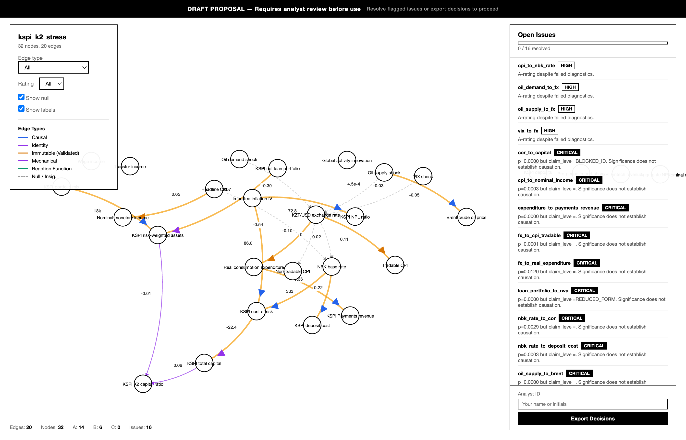
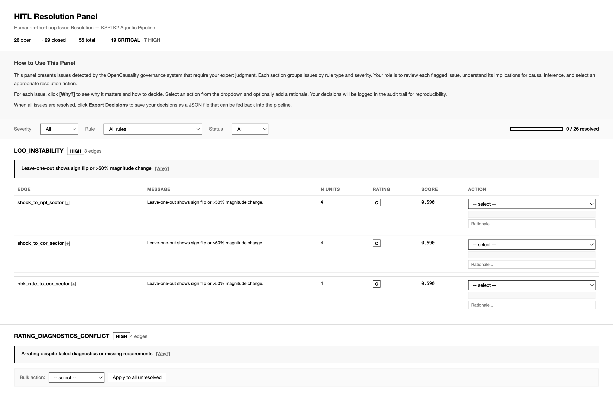
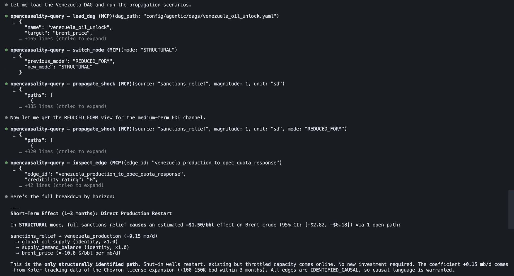

```
    ___                    ____                        _ _ _
   / _ \ _ __   ___ _ __  / ___|__ _ _   _ ___  __ _ | (_) |_ _   _
  | | | | '_ \ / _ \ '_ \| |   / _` | | | / __|/ _` || | | __| | | |
  | |_| | |_) |  __/ | | | |__| (_| | |_| \__ \ (_| || | | |_| |_| |
   \___/| .__/ \___|_| |_|\____\__,_|\__,_|___/\__,_||_|_|\__|\__, |
        |_|                                                    |___/

  ~  sketch your causal story  ~  we find the papers, collect the
  data, pick the estimator, run the regressions, and tell you
  what's wrong before you publish something you'll regret  ~
```

# OpenCausality

You describe a causal story. OpenCausality estimates every edge, flags what's wrong, and blocks any claim the research design can't support — all in a hash-chained audit trail.

> **Paper:** [OpenCausality: Auditable Agentic Causal Inference](paper/main.pdf) (Li, 2026)
> **Full reference:** [REFERENCE.md](REFERENCE.md) — complete architecture, CLI reference, adapter details, and design philosophy.

---

## Quick Start

```bash
pip install -e .
opencausality init                    # creates .env with API keys
opencausality dag list                # see available DAGs
opencausality dag run my_dag.yaml     # estimate everything
opencausality query --dag my_dag.yaml # ask questions in plain English
```

No API key? Use `LLM_PROVIDER=claude_cli` or `LLM_PROVIDER=codex` — they shell out to local CLIs.

---

## What It Does

| Step | What happens |
|------|-------------|
| **You write a DAG** | Nodes + directed edges in YAML. Expected signs, identification strategies, unit specs. |
| **Agents run** | DataScout finds data. ModelSmith picks estimators. Estimator runs 19 adapters. Judge scores credibility. |
| **Guardrails fire** | 38 issue rules, 7 propagation guardrails, TSGuard time-series checks. Claims that the design can't support are blocked. |
| **You review** | Interactive HTML panels open automatically. Accept, reject, revise, or escalate each flagged issue. |
| **Audit trail** | Every decision — human and machine — is logged in a hash-chained JSONL ledger. |

The central design rule: **claim levels are a one-way ratchet.** The research design sets a ceiling. Diagnostics and human review can only push it down, never up. Good p-values don't make an OLS estimate causal.

<p align="center">
  
</p>
<p align="center"><em>Interactive DAG visualization with color-coded edges, severity badges, and issue sidebar. Every output is framed as "DRAFT PROPOSAL — Requires analyst review."</em></p>

---

## Case Study: Kazakhstan Bank Stress Testing

Starting from a single paragraph describing how FX shocks propagate to bank capital:

| Metric | NL-Extracted | After Critic (4 iters) | Full Pipeline |
|--------|-------------|----------------------|---------------|
| Nodes / Edges | 18 / 22 | 20 / 22 | 20 / 26 |
| Quality score | 0.349 | 0.668 | **0.894** |
| Open causal paths | 0/9 | 9/9 | **33/33** |
| Contributor paths to target | — | — | **91** |
| Identification coverage | 0% | 100% | 100% |

The NL pipeline also discovered **9 edges absent from the expert-built DAG**, including VIX → bank funding costs (risk-taking channel) and household income → cost of risk (bank lending channel).

<p align="center">
  
</p>
<p align="center"><em>Human-in-the-Loop resolution panel. Issues grouped by rule type and severity. Each card has accept/reject/revise/escalate actions with justification fields. All decisions are hash-chained.</em></p>

---

## Worked Example: Venezuelan Oil Supply Unlock

The full pipeline — from a paragraph of analysis to a governed causal DAG to quantitative scenario answers — in three steps.

### Step 1: Natural Language → DAG

You write a paragraph describing a causal story. OpenCausality extracts nodes, edges, identification strategies, and unit specifications.

**Input** (plain text):

> When the United States lifts sanctions on Venezuela, the immediate effect is a
> reopening of export channels — shut-in wells restart, adding roughly 100-150
> thousand barrels per day. But the larger effect operates through investment:
> Chevron, Repsol, ENI deploy capital into well workovers and upgrader repairs.
> Venezuelan production feeds mechanically into global supply. OPEC may cut quotas
> to offset the increase — a strategic reaction, not a structural equation. The
> supply-demand balance determines price: with short-run demand elasticity of -0.05,
> even modest supply increases produce outsized price effects.

**Output** (extracted DAG YAML — abbreviated):

```yaml
nodes:
  - id: sanctions_relief
    name: US sanctions relief on Venezuela
    unit: index
    exogenous: true

  - id: fdi_oil_sector
    name: FDI into Venezuelan oil sector
    unit: bn_usd

  - id: venezuela_production
    name: Venezuelan crude oil production
    unit: mb_per_d

  - id: global_oil_supply
    name: Global oil supply
    unit: mb_per_d
    derived: true
    identity:
      formula: "venezuela_production + opec_quota_response + non_opec_supply_growth"

  - id: supply_demand_balance
    name: Oil supply-demand balance
    unit: mb_per_d
    derived: true
    identity:
      formula: "global_oil_supply - global_oil_demand"

  - id: brent_price
    name: Brent crude oil price
    unit: usd_per_bbl

edges:
  # Direct channel (short-run, 1-3 months)
  - id: sanctions_relief_to_venezuela_production
    from: sanctions_relief
    to: venezuela_production
    edge_type: causal                        # structurally identified
    unit_specification:
      treatment_unit: index
      outcome_unit: mb_per_d

  # Investment channel (medium-run, 12-24 months)
  - id: fdi_oil_sector_to_venezuela_production
    from: fdi_oil_sector
    to: venezuela_production
    edge_type: causal                        # reduced-form — weaker ID
    unit_specification:
      treatment_unit: bn_usd
      outcome_unit: mb_per_d

  # OPEC strategic response — NOT on causal path
  - id: venezuela_production_to_opec_quota_response
    from: venezuela_production
    to: opec_quota_response
    edge_type: reaction_function             # blocked in all propagation modes

  # Accounting identities (coefficient = 1.0 by construction)
  - id: venezuela_production_to_global_oil_supply
    from: venezuela_production
    to: global_oil_supply
    edge_type: identity

  # Price formation
  - id: supply_demand_balance_to_brent_price
    from: supply_demand_balance
    to: brent_price
    edge_type: causal
    unit_specification:
      treatment_unit: mb_per_d
      outcome_unit: usd_per_bbl
```

The extractor identifies 11 nodes, 13 edges, 6 channels, and correctly types the OPEC response as a `reaction_function` (excluded from counterfactual propagation) rather than a structural equation.

### Step 2: The DAG Structure

The resulting model has 6 distinct channels with different identification strengths:

```
sanctions_relief (exogenous policy shock)
  │
  ├──→ venezuela_production ──→ global_oil_supply ──→ balance ──→ brent_price
  │    (direct, +0.15 mb/d)     (identity, 1:1)       (identity)   (-$10/bbl per mb/d)
  │
  ├──→ fdi_oil_sector ──→ venezuela_production  (investment channel, 12-24mo lag)
  │
  └──→ [BLOCKED] opec_quota_response            (reaction function, not propagated)

brent_price ──→ fdi_oil_sector                  (feedback loop, dampening)
```

Each edge carries:
- **Claim level**: `IDENTIFIED_CAUSAL`, `REDUCED_FORM`, or `DESCRIPTIVE` — set by research design, not by p-values
- **Unit specification**: ensures dimensional consistency across the chain (mb/d → mb/d → $/bbl)
- **Edge type**: `causal`, `identity`, `reaction_function` — determines which propagation modes allow the edge
- **Validated evidence**: literature estimates with sources (e.g., Caldara, Cavallo & Iacoviello 2019)

### Step 3: Query → Hedged Narrative

Ask a question in Claude Code:

```
You:  "What happens to oil prices if sanctions are fully lifted?"
```

The MCP server runs `propagate_shock(sanctions_relief, 1.0, index)` and returns structured results. The economics guardrails plugin then enforces hedged language rules on Claude's interpretation:

**Engine result** (abbreviated):

```
Structural path: sanctions → production → supply → balance → price
  Coefficients:    +0.15        × 1.0       × 1.0     × -10.0
  Total effect:    -$1.50/bbl   (SE: $0.67, 95% CI: [-$2.82, -$0.18])
  Paths open: 1    Paths blocked: 3
```

**Claude's narrative** (governed by hedged language rules):

> In **STRUCTURAL** mode, full sanctions relief **causes** an estimated
> -$1.50/bbl effect on Brent crude (95% CI: [-$2.82, -$0.18]) via 1 open
> path through the direct production restart channel.
>
> 3 additional paths are blocked: the FDI-investment channel (2 edges lack
> STRUCTURAL eligibility), and the OPEC response (reaction function, excluded
> from counterfactual propagation).
>
> Standard errors assume independence between edge estimates and may understate
> true uncertainty. These are draft estimates requiring analyst verification.

Notice: "causes" is allowed here because every edge on the open path is `IDENTIFIED_CAUSAL`. If the FDI path were included (REDUCED_FORM mode), the verb would downgrade to "is associated with." The OPEC reaction function is reported but never mechanically propagated — because OPEC is a strategic actor whose future behavior may diverge from historical patterns.

---

## Claude Code Plugin

Open the project in Claude Code and just ask:

```
You:   "What if oil drops 30%?"
Claude: → propagate_shock(brent_price, -0.30, pct)
        → narrates results with hedged language, cites guardrail blocks

You:   "Which edges are weakly identified?"
Claude: → get_identification() → formats table of claim levels and risks

You:   "Run placebo tests"
Claude: → run_placebo() → inspect_edge() for failures → synthesizes findings
```

13 MCP tools. Full guardrail enforcement. Read-only — AI exploration can't alter governed artifacts.

<p align="center">
  
</p>
<p align="center"><em>Claude Code MCP plugin in action. User asks a natural language question, the propagation engine returns structured results with open/blocked paths, and the econ-guardrails hooks enforce hedged language — "causes" in STRUCTURAL mode downgrades to "is associated with" in REDUCED_FORM.</em></p>

```bash
pip install "mcp>=1.0.0"  # only prerequisite
# verify: /mcp in Claude Code → opencausality-query with 13 tools
```

### Economics Guardrails Plugin

The `econ-guardrails/` plugin adds a four-layer defense against economics reasoning errors in Claude's interpretation of query results:

| Layer | Mechanism | When |
|-------|-----------|------|
| **Prevention** | Background skill with error taxonomy + hedged language rules | Always loaded |
| **Interpretation guard** | PostToolUse hooks inject hedged language constraints | After each MCP propagation call |
| **Result validation** | PostToolUse command hook validates propagation JSON | After each MCP propagation call |
| **Output audit** | Stop hooks check for sign errors, unit mixing, causal over-claims, arithmetic mistakes | Before every response |

Install: symlink `econ-guardrails/` into `~/.claude/plugins/local/` and restart Claude Code.

---

## For AI Agents: MCP Integration Guide

This section is for AI agents (Claude Code, custom MCP clients, agent frameworks) that want to use OpenCausality's causal reasoning engine programmatically. The MCP server exposes 13 read-only tools — you can query, inspect, and propagate shocks through governed causal DAGs without modifying any artifacts.

### Connect

Add to your `.mcp.json` (or equivalent MCP client config):

```json
{
  "mcpServers": {
    "opencausality-query": {
      "command": "python",
      "args": ["-m", "shared.mcp.query_server"],
      "env": { "PYTHONPATH": "." }
    }
  }
}
```

The server runs via stdio transport. No API keys needed for the query engine itself.

### Quickstart Workflow

Every session follows the same pattern: **load → inspect → propagate → interpret**.

```
1. load_dag(dag_path="config/agentic/dags/my_dag.yaml")   # REQUIRED first
2. list_nodes()                                             # see what's in the DAG
3. list_edges(mode="STRUCTURAL")                            # see edges + which are allowed
4. propagate_shock(source="x", magnitude=-0.30, unit="pct") # run a scenario
5. inspect_edge(edge_id="x_to_y")                           # drill into any edge
```

### Tool Reference

**Setup & Navigation**

| Tool | Purpose | Key Parameters |
|------|---------|----------------|
| `load_dag` | Load DAG YAML + edge cards + issues. **Must call first.** | `dag_path` (string) |
| `list_nodes` | All nodes with id, name, frequency, type | — |
| `list_edges` | All edges with role, claim level, allowed status | `mode?` |
| `switch_mode` | Change active query mode | `mode`: `STRUCTURAL` \| `REDUCED_FORM` \| `DESCRIPTIVE` |

**Propagation & Paths**

| Tool | Purpose | Key Parameters |
|------|---------|----------------|
| `propagate_shock` | Propagate a shock scenario through the DAG | `source`, `magnitude`, `unit?` (`pct`/`pp`/`sd`/`bps`), `target?`, `mode?` |
| `propagate_policy` | Propagate a policy intervention (stricter: requires STRUCTURAL + IDENTIFIED_CAUSAL) | Same as `propagate_shock` |
| `find_paths` | Find all paths between two nodes, with blocked reasons | `source`, `target`, `mode?` |
| `target_contributors` | Rank all source nodes by effect size on target | `target`, `mode?` |

**Inspection & Diagnostics**

| Tool | Purpose | Key Parameters |
|------|---------|----------------|
| `inspect_edge` | Full edge card: estimates, credibility, identification, TSGuard, issues, literature | `edge_id` |
| `get_identification` | Identification summary for all edges: claim levels + risks | — |
| `compare_modes` | Edge permissions across all three modes side-by-side | — |
| `run_placebo` | Falsification tests on missing edges (Markov property) | `max_tests?`, `alpha?` |
| `dag_doctor` | Health check: coverage, issues, missing cards | — |

### Reading Propagation Results

`propagate_shock` and `propagate_policy` return a `paths` array. Each path is either open or blocked:

```json
{
  "paths": [
    {
      "is_blocked": false,
      "total_effect": -1.5,
      "total_se": 0.67,
      "ci_lower": -2.82,
      "ci_upper": -0.18,
      "edges": [
        {"edge_id": "a_to_b", "coefficient": 0.15, "claim_level": "IDENTIFIED_CAUSAL", "role": "structural"},
        {"edge_id": "b_to_c", "coefficient": -10.0, "claim_level": "IDENTIFIED_CAUSAL", "role": "structural"}
      ]
    },
    {
      "is_blocked": true,
      "blocked_reasons": ["mode_restriction: ... not allowed in STRUCTURAL", "reaction_function edges are never allowed"],
      "edges": [...]
    }
  ],
  "blocked_edges": [{"edge_id": "...", "reason": "..."}],
  "mode": "STRUCTURAL",
  "scenario_type": "shock"
}
```

**Key fields to extract:**
- Sum `total_effect` across all open paths (`is_blocked: false`) for the aggregate effect
- `blocked_reasons` explains *why* each path is gated — always surface these to users
- `scaled_effect` / `scaled_ci_lower` / `scaled_ci_upper` are the unit-adjusted values to report
- `warnings` contains SE independence caveats for multi-edge paths

### Interpreting Results: Hedged Language Rules

**This is the most important section.** When narrating propagation results, your language must match the identification strength. These are hard rules, not suggestions.

**Rule 1 — Verb choice depends on the weakest claim level on any open path:**

| Weakest claim on path | Allowed verbs | Forbidden |
|---|---|---|
| `IDENTIFIED_CAUSAL` (all edges) | "causes", "the structural estimate implies" | — |
| `REDUCED_FORM` (any edge) | "is associated with", "predicts" | "causes", "drives", "leads to", "results in" |
| `DESCRIPTIVE` | "correlates with", "co-moves with" | All causal + associative language |

**Rule 2 — Always state the query mode.** Every interpretation must name the mode explicitly:
> "In **STRUCTURAL** mode, a -30% shock to oil prices causes..."

**Rule 3 — Report blocked paths.** Never silently omit them:
> "2 open paths, 3 blocked (2 due to mode gating, 1 reaction function)"

**Rule 4 — SE independence disclaimer** for any path with 2+ edges:
> "Standard errors assume independence between edge estimates and may understate true uncertainty."

**Rule 5 — Draft framing.** All results are draft estimates:
> "These are draft estimates requiring analyst verification."

**Template:**

> In **[MODE]** mode, a [magnitude] [unit] shock to [source] **[causes / is associated with]** an effect of [scaled_effect] [unit] on [target] (95% CI: [ci_lower, ci_upper]) via [N] open path(s). [K] path(s) are blocked due to [reasons]. Standard errors assume independence between edge estimates. These are draft estimates requiring analyst verification.

### Three Query Modes

| Mode | What it allows | When to use |
|------|---------------|-------------|
| **STRUCTURAL** | Only `IDENTIFIED_CAUSAL` edges with structural/identity roles | Counterfactual questions: "What would happen if X?" |
| **REDUCED_FORM** | Also allows `REDUCED_FORM` edges | Association questions: "What is X associated with?" |
| **DESCRIPTIVE** | All edges including correlations | Exploration: "What co-moves with X?" |

Use `switch_mode()` or pass `mode` as a parameter to any propagation tool. Default is REDUCED_FORM.

### Edge Types and What Gets Blocked

| Edge type | STRUCTURAL | REDUCED_FORM | DESCRIPTIVE |
|-----------|-----------|-------------|-------------|
| `causal` (IDENTIFIED_CAUSAL) | Allowed | Allowed | Allowed |
| `causal` (REDUCED_FORM) | **Blocked** | Allowed | Allowed |
| `identity` | Allowed (coeff=1.0) | Allowed | Allowed |
| `reaction_function` | **Blocked always** | **Blocked always** | **Blocked always** |
| `bridge` / `mechanical` | Allowed | Allowed | Allowed |

`reaction_function` edges are **never propagated** in any mode — they represent strategic responses (e.g., OPEC quota adjustments) whose future behavior cannot be mechanically predicted from historical patterns. They appear in `inspect_edge` results for informational purposes only.

### Common Agent Patterns

**Pattern 1: Answer a "what if" question**
```
load_dag(dag_path) → propagate_shock(source, magnitude, unit) → narrate with hedged language
```

**Pattern 2: Assess DAG quality before querying**
```
load_dag(dag_path) → dag_doctor() → get_identification() → compare_modes()
```

**Pattern 3: Investigate a suspicious edge**
```
inspect_edge(edge_id) → check credibility_rating, claim_level, open_issues, counterfactual eligibility
```

**Pattern 4: Find what drives a target variable**
```
target_contributors(target) → inspect_edge() on top contributors → propagate_shock() on the most important source
```

**Pattern 5: Validate DAG structural integrity**
```
run_placebo(max_tests=20) → any failures suggest missing edges → inspect_edge() on flagged pairs
```

### Available DAGs

```bash
ls config/agentic/dags/   # list all DAG YAML files
```

Bundled examples:
- `kz_bank_stress.yaml` — Kazakhstan bank stress testing (FX → bank capital, 20 nodes, 26 edges)
- `venezuela_oil_unlock.yaml` — Venezuelan oil supply unlock (sanctions → oil prices, 11 nodes, 13 edges)

### Error Handling

- Calling any tool before `load_dag` returns an error message — always load first
- NaN/Infinity values are serialized as strings (`"NaN"`, `"Inf"`) for JSON safety
- If all paths are blocked, `total_effect` will be 0.0 on every path — check `is_blocked` flags, don't interpret zeros as "no effect"

---

## Key Features

**Estimation** — 19 adapters: Local Projections, Panel FE, IV-2SLS, DiD, RDD, Regression Kink, Synthetic Control, DoWhy (Backdoor/IV/Frontdoor), DoubleML, EconML CATE, CausalML Uplift, plus Identity/Bridge/Immutable.

**Propagation** — 7 guardrails gate every causal path: mode gating, counterfactual eligibility, TSGuard diagnostics, issue severity, reaction-function blocking, unit compatibility, frequency alignment. Delta-method SEs with independence caveat.

**Issue Detection** — 38 rules catch overclaiming, control shopping, null dropping, specification drift, timing failures. PatchBot auto-fixes safe issues (missing units, edge ID syntax). PatchPolicy explicitly prohibits control shopping, sample trimming, lag searching, outcome switching.

**DAG Critic** — Iterative LLM-based refinement with 10 revision types, 4 causal logic probes, 7-component quality score. KnowledgeScout auto-researches missing formulas. DAGHealthSnapshot tracks per-edge health to catch regressions. Data-availability oracle rejects edges with no data.

**Sentinel Loop** — Always-on background monitor. Auto-starts with the pipeline, re-validates the DAG after every change, auto-heals schema issues, rebuilds and opens HTML panels on completion.

**Governance** — Hash-chained JSONL audit log (no database). HITL panel with accept/reject/revise/escalate. Claim levels determined by design, not results. Everything is git-committable.

---

## DAG in 30 Seconds

```yaml
nodes:
  - id: fx_shock
    label: "Exchange Rate Shock"
    variable: "usdkzt_pct_change"
    frequency: monthly

edges:
  - source: fx_shock
    target: cpi_inflation
    expected_sign: positive
    identification: back_door
    controls: [oil_price, policy_rate]
    unit_spec: "1pp FX depreciation -> X pp inflation"
```

Each edge is a testable hypothesis. The system estimates it, checks identification, flags issues, and produces an EdgeCard (YAML) with estimates, diagnostics, credibility rating, and literature references.

---

## Architecture

```
shared/
├── agentic/          # DAG parser, agents, governance, issues, propagation
│   ├── agents/       #   DataScout, PaperScout, DAGCritic, KnowledgeScout,
│   │                 #   PatchBot, ModelSmithCritic, PaperDAGExtractor
│   ├── propagation.py #  PropagationEngine (7 guardrails)
│   └── ts_guard.py   #  Time-series validator (7 diagnostics)
├── engine/           # 19 estimation adapters + data assembly
├── llm/              # LLM abstraction (Anthropic, LiteLLM, Claude CLI, Codex CLI)
└── data/             # Data clients

config/agentic/dags/  # Your DAG YAML files
outputs/agentic/      # EdgeCards, issues, audit logs, HTML panels
```

---

## Agent Pipeline

| Agent | What it does |
|-------|-------------|
| **DataScout** | Finds and fetches data. Oracle functions reject edges with no data. |
| **ModelSmith** | Picks estimation design from 19 adapters based on DAG structure. |
| **Estimator** | Runs estimation, TSGuard diagnostics, produces EdgeCards. |
| **Judge** | Scores credibility, flags weak links, triggers PatchBot for safe fixes. |
| **DAGCritic** | LLM-based iterative refinement with eval framework. |
| **KnowledgeScout** | Researches missing identity formulas via Claude CLI. |

---

## CLI

```bash
opencausality dag run <path>              # full estimation pipeline
opencausality dag validate <path>         # check structure only
opencausality dag generate <narrative>    # NL text → DAG
opencausality dag viz                     # interactive D3.js graph
opencausality query                       # natural language REPL
opencausality config doctor               # diagnose setup issues
opencausality benchmark run --suite all   # run DGP + ACIC benchmarks
```

Full CLI reference: [REFERENCE.md](REFERENCE.md#cli-reference)

---

## Limitations

- **NL-to-DAG is lossy.** Single paragraphs can't encode full causal chains. Treat extracted DAGs as hypotheses.
- **LLMs hallucinate edges.** All LLM-extracted edges must pass HITL review before use.
- **Independence assumption.** Delta-method SEs assume edge independence. Shared confounders cause underestimation.
- **Limited case studies.** The platform is domain-agnostic, but bundled data clients are Kazakhstan-specific. The Venezuela model uses validated literature estimates rather than estimated data.

---

## Contributing

Fork, branch from `main`, PR. Write tests (`pytest`). Follow existing patterns (dataclasses, YAML, JSONL). Run `ruff check shared/ scripts/`. See [REFERENCE.md](REFERENCE.md#contributing) for details.

## License

MIT. See [LICENSE](LICENSE).
